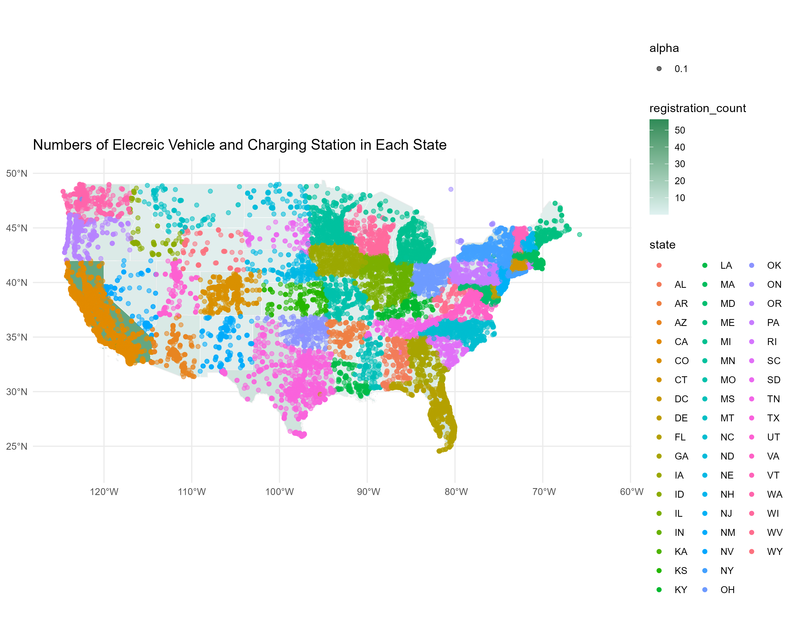
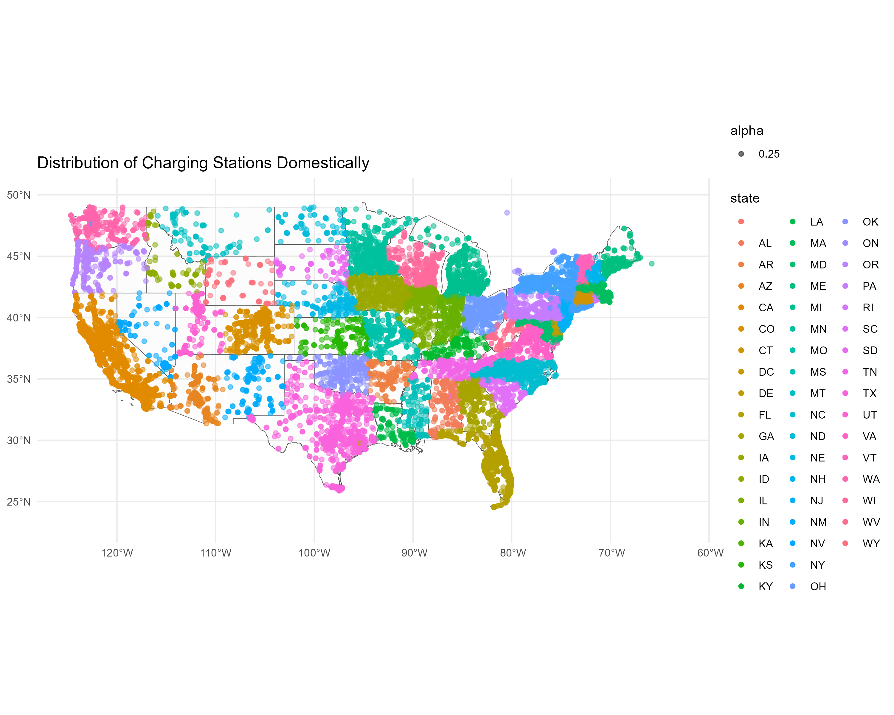
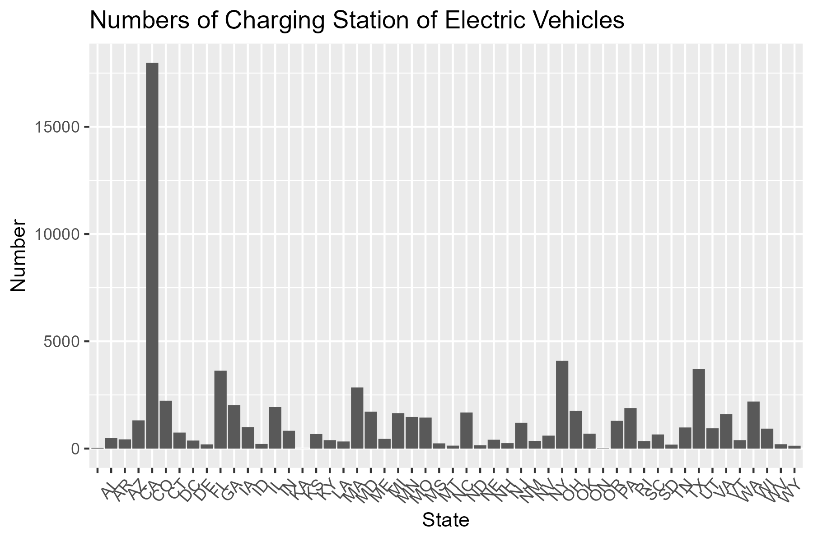
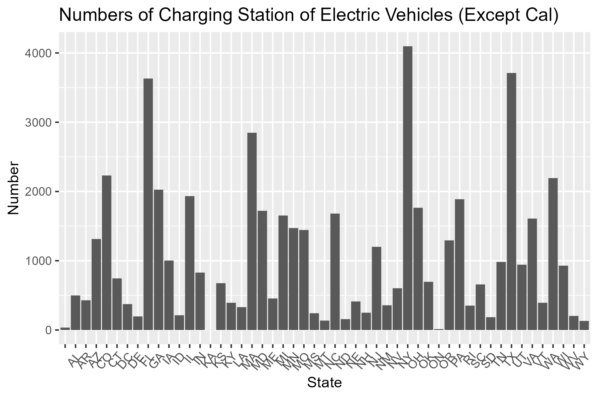
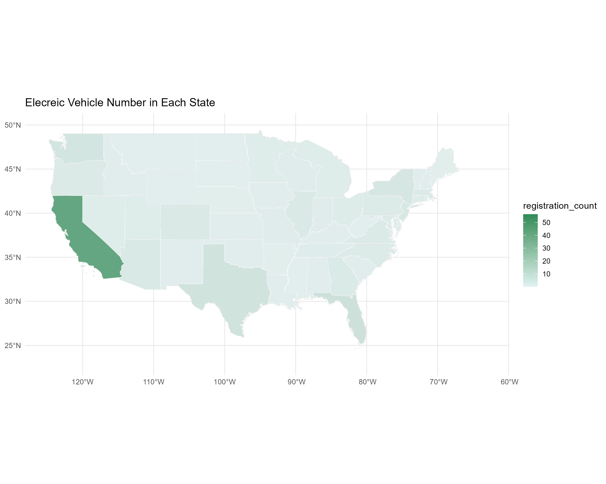
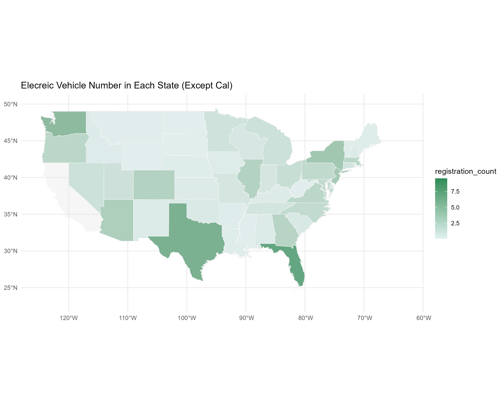

# Data Science Final Project
### AUTHOR: Yixuan Li, Ruining Zheng

### Background & Motivation
Considering the energy-saving and CO2 emission reduction effect, many people now are more willing to purchase electric vehicles rather than traditional fossil fuel vehicles. Based on data from [IEA](https://www.iea.org/data-and-statistics/data-tools/global-ev-data-explorer), in the US, the registration number and rate for electric vehicles are not high compared with other developed countries. 
In China, charging stations usualy concerntrate in large shopping malls or public parking lots in city center. However, in the US, we didn't see clustered charging stations. The [number of charging stations](https://afdc.energy.gov/fuels/electricity_locations.html#/find/nearest?fuel=ELEC&country=US) in the US is also not high, which can be a factor influencing the electric vehicle owners'experience. Therefore, we want to investige what can influence the number of charging stations.
We plan to establish a predicting model to predict the number of charging stations in each area in the US. This are is defined based on zip code, and the relavant data is from [Census](https://www.census.gov/programs-surveys/geography/guidance/geo-areas/zctas.html).

### Variables & Data
The dependent variable is the number of charging stations in each area. In order to test if our model is reliable, we also found true data of distribution of charging stations from [the Department of Energy](https://afdc.energy.gov/fuels/electricity_locations.html#/find/nearest?fuel=ELEC&country=US). 
Our independent variables are the population in zipcode area, annual household income, and the number of poeple driving to work. These data are all from [America Community Survey in 2021](https://api.census.gov/data/2021/acs/acs1/variables.html). 

### Models
In order to find a proper model to predict, we tested linear model, random forest, and a knn model. We compared the average RMSE of each model. The result shows that the random forest model has the smallest average RMSE, which is around 3.677853.
Then we fit the random forest model to the test data, and evaluate the result. 
```rand_finalfinal <- rand_final %>%
  fit(data = census_train)
  rand_pred <- rand_finalfinal %>%
  predict(new_data = census_test)
  ```
Comparing with true distribution of charging stations, the prediction result of the random model is good. The RMSE is 2.129522; since the largest value of the number of charging station in one area with the same zipcode is 29 (after we drop the extreme values), this rmse is acceptable (about 7% of the true value).

### Visualization
1. We visualized the distribution of electric charging stations in the US. 
```
ggplot() +
  geom_sf(data = us_boundary, alpha = 0.1) +
  geom_sf(data = charging_sf, mapping = aes(color = state, alpha = 0.25)) +
  coord_sf(xlim = c(-63, -125), ylim = c(23, 50)) +
  labs(title = "Distribution of Charging Stations Domestically") +
  theme_minimal()
```

The number of charging stations is appearantly higher in the North-East region and in California, but lower in the Middle.

2. We employ bargrams to see the difference of electric vehicles in each states. 
```
charging_sf %>%
  group_by(state) %>%
  count() %>%
  ggplot() + 
  geom_col(mapping = aes(x = state, y = n)) +
  xlab("State") +
  ylab("Number") +
  labs(title = "Numbers of Charging Station of Electric Vehicles") +
  theme(axis.text.x = element_text(angle = 50, hjust = 1))
```

However, we noticed that California has a extremely high number of vehicles that made us hard to see the difference in other states, thus, we exclude the data from California and redraw the gram. 


We then transfre the data into spatial data and visualize the number of electric vehicles in each state and showing them by color on a map.
```
ggplot() +
  geom_sf(data = ev_sf, aes(fill = registration_count)) +
  geom_sf(data = us_boundary, alpha = 0.3, color = "white") +
  coord_sf(xlim = c(-63, -125), ylim = c(23, 50)) +
  scale_fill_gradient(low = "#E0F2F1", high = "#2E8B57") +
  labs(title = "Elecreic Vehicle Number in Each State") +
  theme_minimal()
```
With California

Without California

Then it is clear that electric vehicles are also popular in Texas and Florida.

3. We combined the distribution of charging stations and number of electric vehicles on the same plot.
```
ggplot() +
  geom_sf(data = ev_sf, aes(fill = registration_count)) +
  geom_sf(data = us_boundary, alpha = 0.3, color = "white") +
  geom_sf(data = charging_sf, mapping = aes(color = state, alpha = 0.1)) +
  coord_sf(xlim = c(-63, -125), ylim = c(23, 50)) +
  scale_fill_gradient(low = "#E0F2F1", high = "#2E8B57") +
  labs(title = "Numbers of Elecreic Vehicle and Charging Station in Each State") +
  theme_minimal()
```
 
 
 #### Discussion
Future Development
Our current project still has some shortcomings due to the lack of reliable data, which probably result from the fact that the electric vehicle industry is still in its early stage of development. Here are some topics that future research can work on.

1. Build a model to predict registered electric vehicle numbers.
We did not include this topic in this project because current data about registered electric vehicles is very limited. The sample size is so small that we do not have enough observations to train the model. When the new energy industry is more developed, related data will be easily accessible and researchers could try to build a model for this.

2. Contain more control variables
We include only three independent variables in this model, which probably miss some predictors that affect the number of charging stations. Actually, the number of electric vehicles can be a useful predictor for the number of charging stations. And the number of charging stations can be useful to predict the number of electric vehicles. The relationship between these two variables deserve further exploration.
